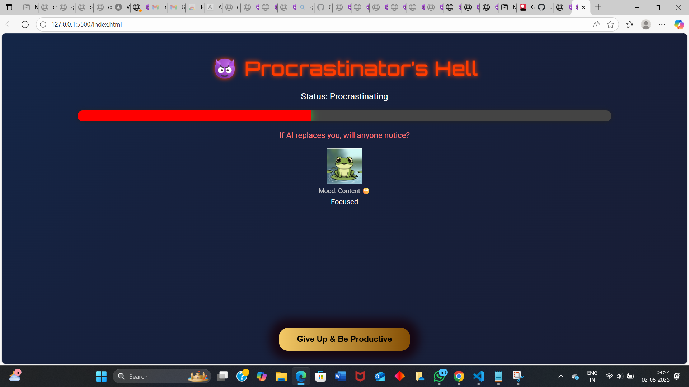
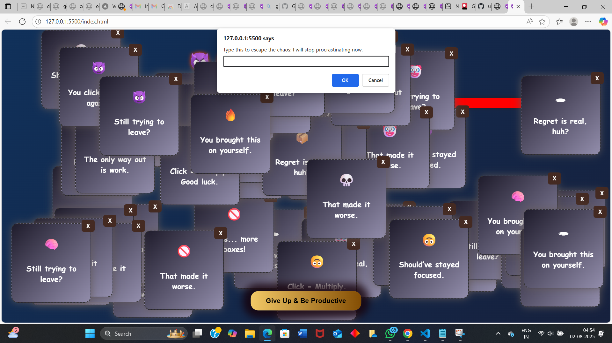
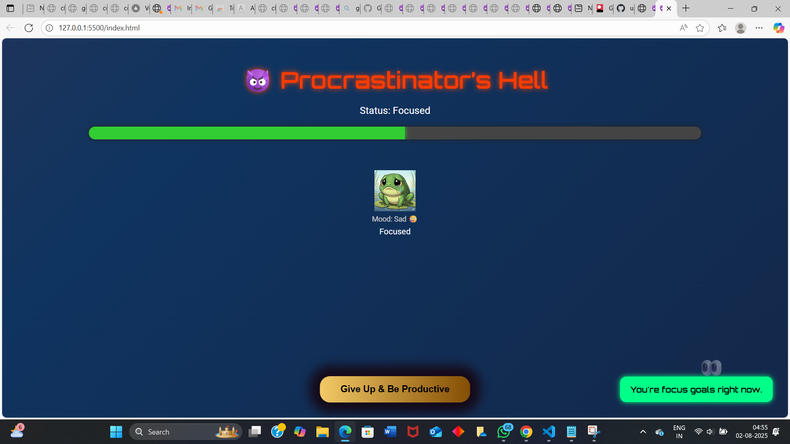
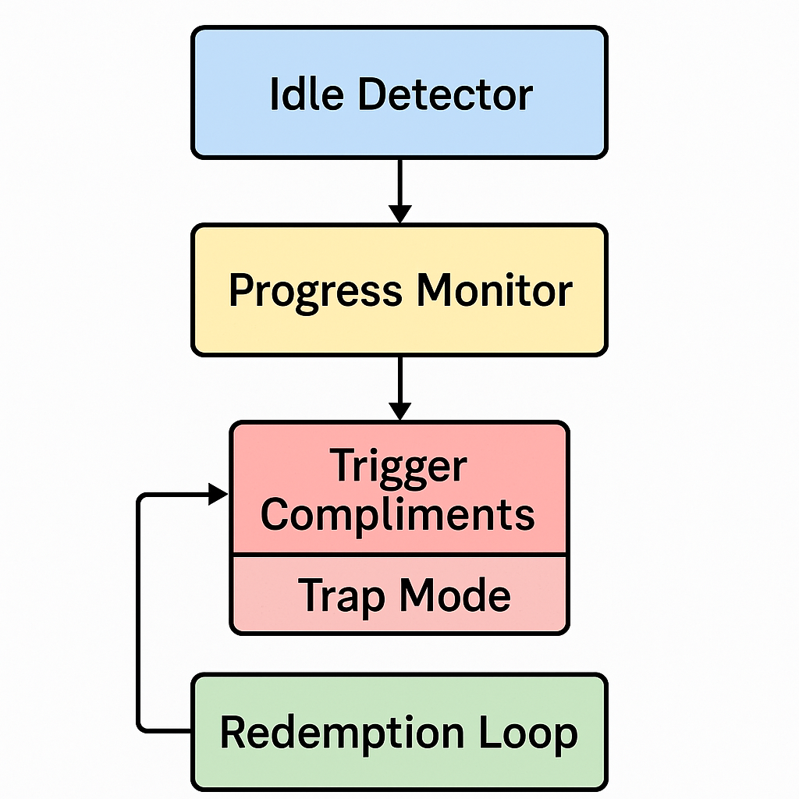

# 🎯 Project Name: Procrastinator’s Hell

---

## 📝 Basic Details

**Team Name**: Code Breakers
**Team Members**
**Team Lead**: Sameeha Fathima - Model Engineering College
**Member 2**: Helen Eldho- Model Engineering College

---

## 💡 Project Description

A chaotic productivity tool that uses guilt-tripping, absurd humor, and psychological warfare to keep users from procrastinating. Detects inactivity and bombards the user with traps and motivation until they return to work.

---

## 🧠 The Problem (that doesn't exist)

People are slacking off too peacefully. There aren’t enough psychological consequences for procrastination. Where's the mental pressure? Where's the digital chaos?

---

## 🧪 The Solution (that nobody asked for)

We created a system that rewards focus with compliments and punishes procrastination with red bars, annoying sound effects, fake warnings, and infinite guilt-trap tabs. It doesn't just monitor—you feel it.

---

## ⚙️ Technical Details

### 💻 For Software:

* **Languages used**: HTML, CSS, JavaScript
* **Frameworks used**: None 
* **Libraries used**: Confetti.js, Anime.js, SweetAlert
* **Tools used**: VS Code, Chrome, GitHub

### 🔌 For Hardware:

* No hardware components used
* Specifications: Basic PC/Laptop
* Tools: Headphones (optional, for full damage)

---


#### Run

```bash
open index.html using chrome no installation required  
```

---

### Project Documentation

**For Software:**

#### Screenshots

  



  

#### Diagrams




---

**For Hardware:**
*(No hardware involved — our weapon is the mind.)*

---

### Project Demo

#### Video


[▶️ Download/Watch Demo Video (vid.mp4)](./vid.mp4) 

---

## Team Contributions

**Sameeha Fathima**: Script logic, UI design, Compliment/Trap mechanics
**Helen Eldho**: Animation, Debugging, HTML styling


---

Made with ❤️, chaos, and poor life choices at **TinkerHub Useless Projects**


---

